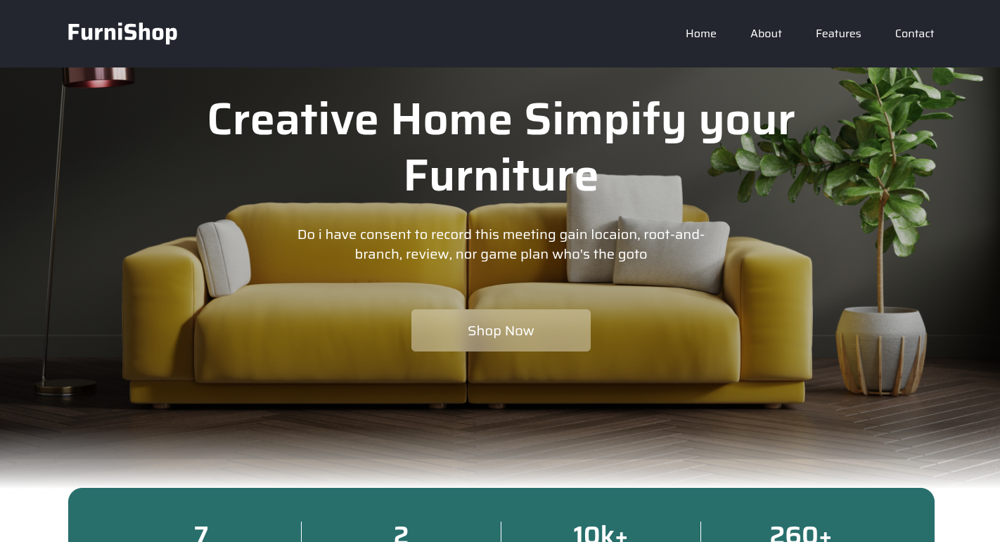
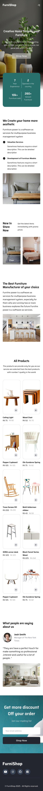
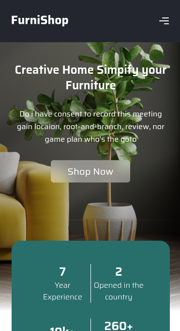
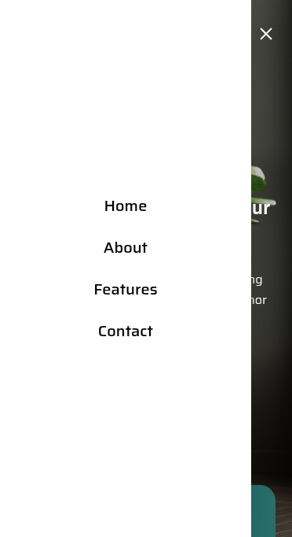

# 🛋️ Furniture Website - Landing Page

Projeto **Landing Page** desenvolvido como um site de móveis. Criado com o intuito de **praticar e aprimorar habilidades de frontend**.

---

## 📑 Sumário

- [🧰 Tecnologias Utilizadas](#-tecnologias-utilizadas)
- [🖥️💡 Visuais (Desktop)](#️-visuais-desktop)
- [📱✨ Visuais (Mobile)](#-visuais-mobile)
- [🚀 Como rodar o projeto](#-como-rodar-o-projeto)
- [📌 Observações](#-observações)
- [📽️ Créditos e Referência](#️-créditos-e-referência)

---

## 🧰 Tecnologias Utilizadas

- ⚛️ **React**: Biblioteca para construção de interfaces interativas.
- 💨 **TailwindCSS 4**: Utilizado para estilização com classes utilitárias.
- 🌊 **Swiper.js**: Biblioteca de sliders/carrosséis responsivos.
- 🎨 **React Icons**: Para uso de ícones.
- ⚡ **Vite**: Ferramenta de build rápida e simples.

---

## 🖥️💡 Visuais (Desktop)

### 📸 Página Completa (Desktop)


### 📸 Header (Desktop)


---

## 📱✨ Visuais (Mobile)

### 📸 Página Completa (Mobile)


### 📸 Header (Mobile)


### 📸 Navbar Mobile


---

## 🚀 Como rodar o projeto

1. Clone o repositório
2. Instale as dependências:
  ```bash
  yarn
  ```
3. Inicie o projeto:
  ```bash
  yarn dev
  ```

---

## 📌 Observações
> 🚧 Projeto baseado em um tutorial do YouTube. Feito com fins educacionais e para prática de desenvolvimento frontend.


## 📽️ Créditos e Referência
Este projeto foi inspirado no vídeo/tutorial do canal [Cristian Mihai](https://www.youtube.com/@cristianmihai01), disponível em: [Create A Furniture Website Design Using React JS And Tailwind CSS](https://www.youtube.com/watch?v=5d6ZMzBegCU&list=PLne3gcjQSComhjGil98JmOvhlK010Grpu)

> Mesmo com algumas modificações, todo o crédito pela ideia base do layout vai para o autor original.